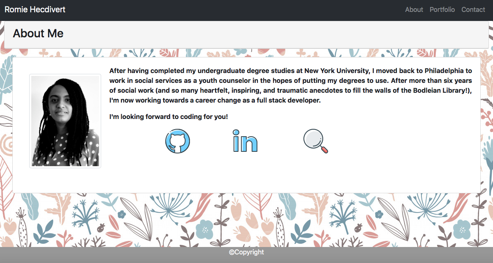
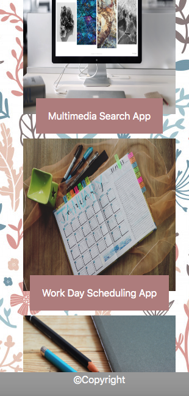

# Responsive Portfolio

# Description

I created a website with a responsive design that can be used dynamically across different devices and differing screen sizes. Using several images as references, I  went on to recreate the website, so that it was framed similar to the provided example. I created the website to have a responsive design by including the appropriate img-fluid and container-fluid tags and made the website accessible by using only semantic elements and including the appropriate alt tags for the all the pictures used.

# Links

1. [Github Repository](https://github.com/rh9891/ResponsivePortfolio/)

2. [Deployed Application](https://rh9891.github.io/ResponsivePortfolio/)

# Preview Images of Responsive Website

